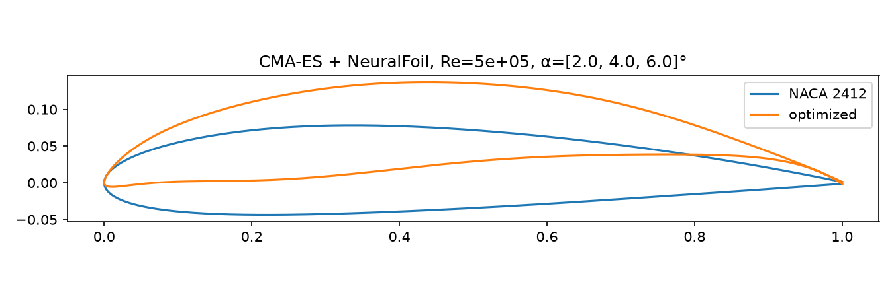
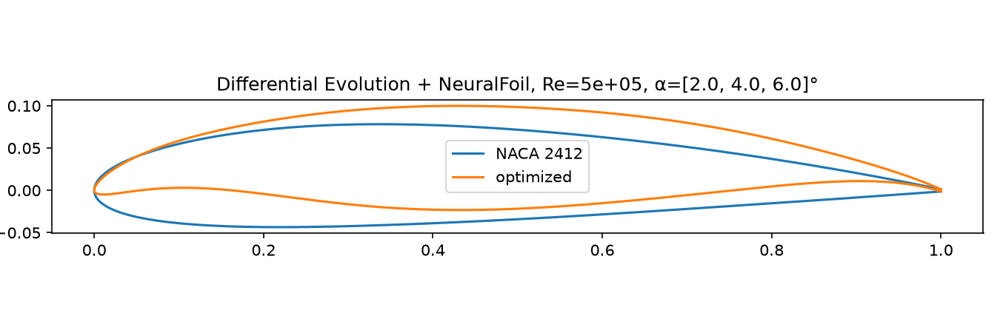
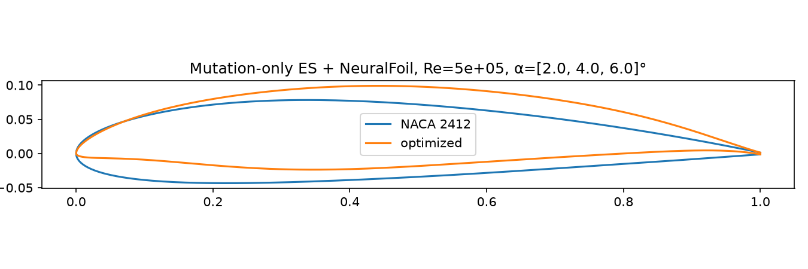

# foil-opt

Airfoil shape optimization with CMA-ES, Differential Evolution or a hand-written mutation-only evolution strategy, and the [NeuralFoil](https://github.com/peterdsharpe/NeuralFoil) surrogate model.

| CMA-ES | Differential Evolution | Mutation-only ES |
|--------|------------------------|------------------|
|  |  |  |

## How it works

- **Shape:** 8 upper and 8 lower Kulfan (CST) weights, plus a leading-edge weight (17 parameters), starting from a NACA 2412
- **Objective:** maximize mean L/D at α = 2°, 4°, 6° and Re = 5·10⁵
- **Constraints (penalties added to −mean L/D):**

  | Constraint | Limit | Weight |
  |------------|-------|--------|
  | Max thickness | ≥ 12% | 1e3 |
  | Surfaces must not cross | thickness ≥ 0 everywhere | 1e3 |
  | Max camber | ≤ 4% | 1e4 |
  | NeuralFoil confidence | ≥ 0.9 at each α | 1e2 |

  Thickness and camber are checked at 50 chord stations. The camber weight is high because extra camber buys a lot of L/D; with a weaker weight the optimizer would accept the penalty and keep the camber.
- **Optimizers:** each generation is scored in one batched NeuralFoil call
  - **CMA-ES** (`cma`): starts at the NACA 2412 with step size σ = 0.03, population 24
  - **Differential Evolution** (`scipy`): searches a box of ±1.0 around the NACA 2412 genome, population 34 (2 × 17 parameters), baseline seeded into the first generation, no gradient polishing
  - **Mutation-only ES** ([`mutation_es.py`](src/foil_opt/mutation_es.py), written from scratch): a (μ + λ) evolution strategy with μ = 6 parents and λ = 24 children, Gaussian mutation only, no crossover. The best 6 of parents + children survive. Step size σ starts at 0.03 and follows the 1/5 success rule (×1.2 if more than 1/5 of children beat their parent, ÷1.2 otherwise); the run stops when σ < 10⁻⁶

All settings are in [`src/foil_opt/config.py`](src/foil_opt/config.py).

## Results

|                    | Mean L/D | Max camber | CL at 4° | CM at 4° | Min confidence |
|--------------------|----------|------------|----------|----------|----------------|
| NACA 2412          | 79       | 1.9%       | 0.70     | −0.05    | 0.97           |
| CMA-ES             | **131**  | 4.0%       | 1.17     | −0.17    | 0.90           |
| Differential Evol. | 128      | 3.9%       | 1.18     | −0.17    | 0.92           |
| Mutation-only ES   | 126      | 4.0%       | 1.05     | −0.15    | 0.95           |

### Optimizer comparison

|                        | CMA-ES   | Differential Evolution | Mutation-only ES |
|------------------------|----------|------------------------|------------------|
| Generations to stop    | ~1,900 (of 2,000 max) | ~230 (converged) | 221 (σ collapsed) |
| Candidates evaluated   | ~46,000  | ~8,000                 | ~5,300           |
| Wall time              | ~28 s    | ~6 s                   | ~4.5 s           |
| Best mean L/D          | 131.1    | 128.0                  | 125.8            |

- CMA-ES and DE reach almost the same shape: more camber, thickness at the 12% limit and camber at the 4% limit, so both constraints are active.
- CMA-ES finds a slightly better optimum (+3 L/D), but needs about 6× the evaluations, mostly spent on small refinements after it is close.
- The mutation-only ES is the cheapest, but it reaches L/D 125 by generation 50 and then only creeps up. With a single isotropic σ it cannot learn which directions in the 17-D genome matter, which is what CMA-ES's covariance matrix adds; this is the likely reason it settles slightly lower.
- DE gets to within a few percent much faster and stops on its own convergence tolerance. It needs search bounds, while CMA-ES only needs a starting point and step size.

> Without the camber limit, the optimum reached L/D ≈ 156 but had over 4% camber and CM ≈ −0.30. Limiting camber to 4% costs about 25 L/D and roughly halves the pitching moment, but CM is still about 3× the NACA 2412's. Next steps are a CM constraint and checking the result with XFoil.

## Usage

```bash
uv sync
uv run python src/cma_example.py                    # CMA-ES
uv run python src/cma_example.py --optimizer de     # Differential Evolution
uv run python src/cma_example.py --optimizer es     # mutation-only ES
```

Writes `optimized_airfoil.png` (CMA-ES), `optimized_airfoil_de.png` (DE) or `optimized_airfoil_es.png` (ES).
