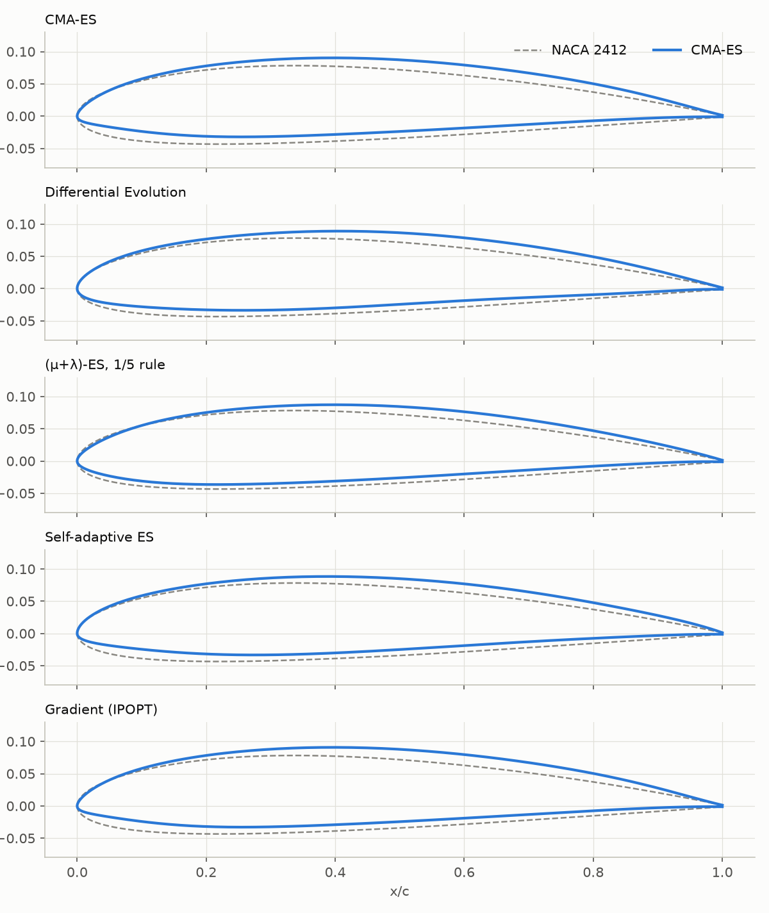
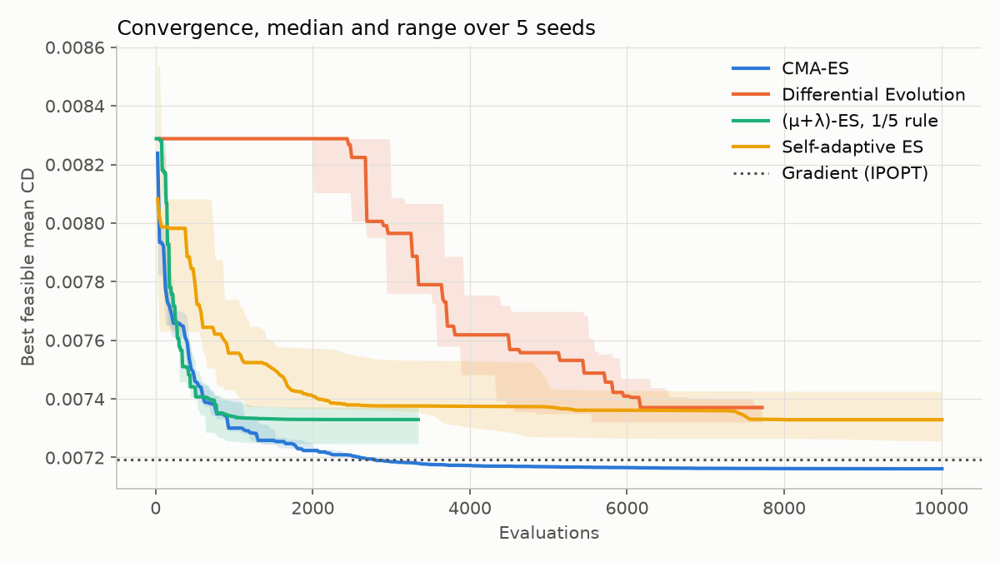
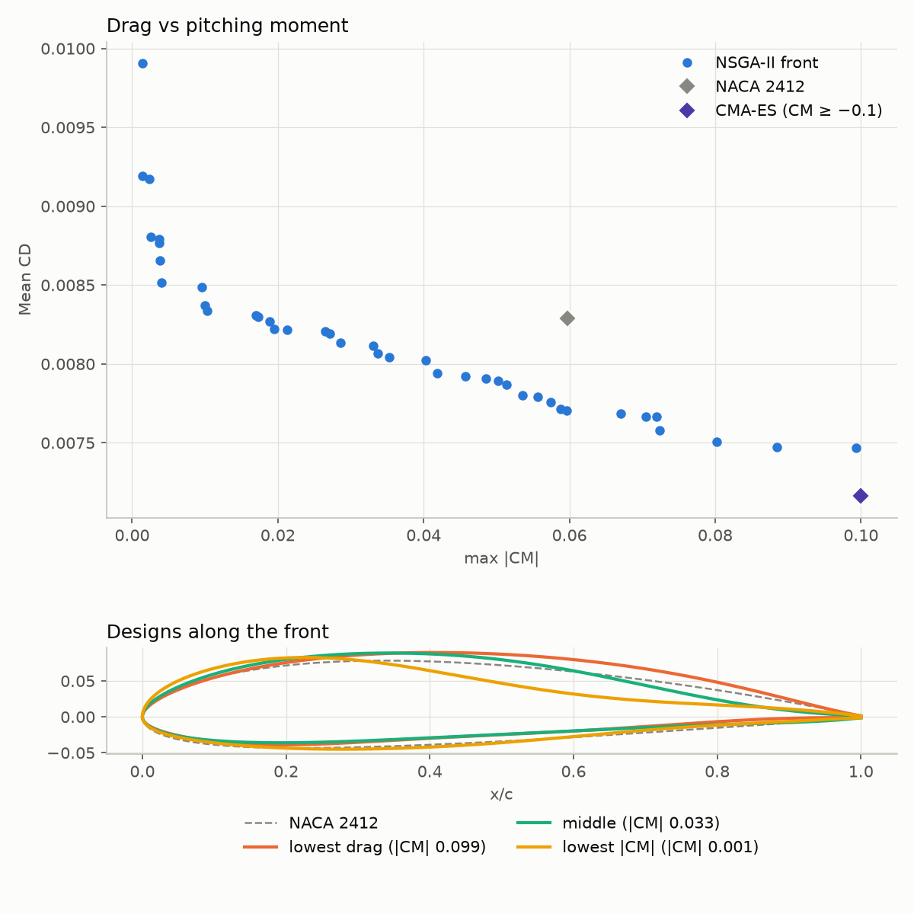

# foil-opt

Airfoil shape optimization on the [NeuralFoil](https://github.com/peterdsharpe/NeuralFoil) surrogate model, comparing four evolutionary optimizers, a gradient-based optimizer and a multi-objective search, with results checked against XFoil.



## The design problem

- **Shape:** 8 upper and 8 lower Kulfan (CST) weights plus a leading-edge weight (17 parameters), starting from a NACA 2412
- **Objective:** minimize mean CD at CL = 0.5 and 0.8, each at Re = 3·10⁵ and 10⁶ (4 operating points). For every candidate the angle of attack that gives each target CL is found with a few secant steps.
- **Constraints:**

  | Constraint | Limit | NACA 2412 |
  |---|---|---|
  | Max thickness | ≥ 12% | 12.0% |
  | Surfaces must not cross | thickness ≥ 0 | ✓ |
  | Thickness at x/c = 0.9 | ≥ 1.5% | 2.9% |
  | Max camber | ≤ 4% | 1.9% |
  | Leading-edge radius | ≥ 0.007 | 0.014 |
  | Trailing-edge angle | ≥ 8° | 16° |
  | CM at every point | ≥ −0.1 | −0.06 |
  | NeuralFoil confidence | ≥ 0.9 | 0.96 |
  | CL max (α = 10–16°, Re = 3·10⁵) | ≥ 1.2 | 1.35 |
  | CL error after the α solve | ≤ 0.01 | ✓ |

- **Constraint handling:** feasibility rule. A feasible design is ranked by mean CD, an infeasible one by its total normalized violation, and every feasible design beats every infeasible one, so there are no penalty weights to tune.

All settings are in [`default.yaml`](src/foil_opt/default.yaml); see [Settings](#settings) to change them.

## Optimizers

| Key | Method | Notes |
|---|---|---|
| `cma` | CMA-ES (`cma`) | σ₀ = 0.03, population 24 |
| `de` | Differential Evolution (`scipy`) | box of ±1.0 around the baseline, population 34, baseline in the first generation |
| `es` | (μ+λ)-ES, written from scratch | Gaussian mutation only, one global σ with the 1/5 success rule; stops when σ < 10⁻⁶ |
| `sa-es` | Self-adaptive (μ,λ)-ES, written from scratch | one σ per gene, adapted log-normally; restarts around the best design after 60 generations without improvement |
| `grad` | Gradient-based, IPOPT via `aerosandbox.Opti` | NeuralFoil and all constraints are differentiable; the angles of attack are variables with CL = target as equality constraints |

Every evolutionary optimizer scores each generation in one batched NeuralFoil call.

## Results

### Comparison at equal budget (10,000 evaluations, 5 seeds)



| Optimizer | Runs | Evaluations | Time | Best mean CD | Median mean CD | Worst mean CD | Best mean L/D |
|---|---|---|---|---|---|---|---|
| NACA 2412 | – | – | – | 0.00829 | – | – | 79.3 |
| CMA-ES | 5 | 10,008 | 18.8 s | **0.00716** | **0.00716** | **0.00716** | **94.2** |
| Differential Evolution | 5 | 7,446 | 14.4 s | 0.00732 | 0.00737 | 0.00738 | 92.1 |
| (μ+λ)-ES, 1/5 rule | 5 | 2,814 | 5.4 s | 0.00725 | 0.00733 | 0.00737 | 92.8 |
| Self-adaptive ES | 5 | 10,008 | 17.3 s | 0.00726 | 0.00733 | 0.00743 | 92.2 |
| Gradient (IPOPT) | 1 | n/a | 2.3 s | 0.00719 | – | – | 93.8 |

Evaluations and time are medians over seeds.

- **CMA-ES** wins: every seed reaches the same optimum, about 14% less drag than the NACA 2412.
- **Gradient (IPOPT)** gets within 0.4% of it in about 2 s, 8× faster. It aims 1% inside every limit, because IPOPT meets constraints only to about 10⁻³; that margin is the likely reason for the gap.
- **The 1/5-rule ES** improves fastest at first, but its single σ collapses after about 2,800 evaluations and it stops. The **self-adaptive ES** uses the whole budget, but its restarts barely improve on that.
- **DE** spends its first ~2,500 evaluations exploring the wide ±1.0 box before it beats the baseline, then converges to a slightly worse design and stops on its own convergence tolerance.
- Every optimizer ends at the 12% thickness limit with CM at −0.1, and all except DE also at the minimum leading-edge radius. Those constraints, not the optimizer, set how far the drag can go down.

### Drag vs pitching moment (NSGA-II)



`foil-opt pareto` drops the CM limit and treats max |CM| as a second objective, using NSGA-II from `leap-ec` (population 60, 200 generations). Getting down to zero pitching moment costs roughly 20–30% more drag, and the zero-moment designs get there by unloading the rear of the upper surface. The front's low-drag end (mean CD 0.00747 at |CM| 0.1) is still above the CMA-ES optimum (0.00716), so NSGA-II has not fully converged there with this budget.

### Check against XFoil

`foil-opt validate` reruns each optimizer's best design in XFoil (viscous, N_crit = 9) at the same target CLs:

- CD: NeuralFoil is within 4% of XFoil at every point, and within 2% at most points.
- CM: within 0.005.
- The DE design comes out at CM = −0.103 in XFoil at one point, just past the limit. Every other design stays within it.

The optimized designs are not artifacts of the surrogate model.

## Settings

Every number above (operating points, constraint limits, optimizer options, budget, output folders) comes from [`src/foil_opt/default.yaml`](src/foil_opt/default.yaml). To change them, write a YAML file with only the values you want different and pass it with `--config`:

```yaml
problem:
  target_cls: [0.3, 0.6, 0.9]
  reynolds: [2e5, 5e5]
constraints:
  max_thickness: {lower: 0.10}
  cm: null                # null disables a constraint
optimizers:
  cma: {popsize: 32}
```

```bash
uv run foil-opt --config configs/example.yaml run cma
```

- Your file is merged over the defaults, so anything you leave out keeps its default value.
- Each constraint takes `lower` and/or `upper`, plus an optional `scale` that normalizes its violation (it defaults to the limit's magnitude). The available constraints are the ones listed in `default.yaml`.
- An unknown key or constraint name stops the run with an error naming the valid options, so a typo can't be silently ignored.
- Every run's JSON in `results/` stores the settings it used.

## Usage

```bash
uv sync
uv run foil-opt run cma                # one optimizer: cma, de, es, sa-es, grad (--seed, --budget)
uv run foil-opt compare                # all optimizers, 5 seeds, 10k evaluations (--optimizers, --seeds, --budget)
uv run foil-opt pareto                 # NSGA-II drag vs |CM| front
uv run foil-opt validate               # best saved designs vs XFoil
uv run foil-opt --config my.yaml ...   # any command with your settings
uv run pytest
```

Runs are saved as JSON in `results/`, and figures as PNGs in `assets/`. `foil-opt compare` takes about 6 minutes.

`validate` needs XFoil, either on the `PATH` or given with `XFOIL=/path/to/xfoil`.

> **Debian/Ubuntu `xfoil` package:** it opens an X11 window and is built to stop on floating-point warnings, so it crashes on most airfoils. Run it with `DISPLAY` unset (`validate` already does this) and with the gfortran trap disabled. One way to disable the trap is to preload a library that makes `_gfortran_set_fpe` a no-op (`void _gfortran_set_fpe(int x) {}`).

## Code layout

```
src/foil_opt/
  default.yaml       default settings: problem, constraint limits, optimizer options, paths
  config.py          loads and validates the YAML settings
  geometry.py        genome <-> Kulfan airfoil
  aero.py            batched NeuralFoil calls, α solve for target CL
  constraints.py     constraint definitions (numeric and symbolic)
  problem.py         objective + constraints for a population, feasibility rule
  evaluator.py       budgeted cost function with history and best design
  optimizers/        cma_es, differential_evolution, mutation_es, self_adaptive_es, gradient
  pareto.py          NSGA-II multi-objective search
  validation.py      XFoil runner and comparison
  experiments.py     running, saving and loading runs
  report.py          text tables
  plotting.py        figures
  cli.py             foil-opt command
configs/             example settings override
tests/               config, geometry, problem, optimizers
```
